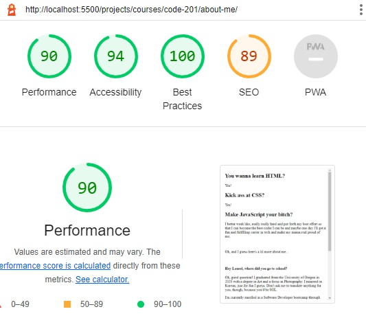

# Lab-02

## About-Me

I'm building a website all about me and my goals, using the HTML, CSS, and JavaScript I'm learning in class.

### Author: Laurel Perkins

### Links and Resources

* I used  https://www.w3schools.com/html/html_emojis.asp to help me withusing emojis in HTML.

* I used https://medium.com/markdown-monster-blog/getting-images-into-markdown-documents-and-weblog-posts-with-markdown-monster-9ec6f353d8ec to help me link the photo here in the ReadMe.

### Lighthouse Accessibility Report Score

### Reflections and Comments

* I'm having a lot of fun with this assignment. I think the repitition is really helping me learn code. JavaScript has been fun to learn and not that difficult so far. I'm really excited to learnwhat I can do with CSS, as I haven't used it much so far. Also, I am very, very unsure about using images in HTML...