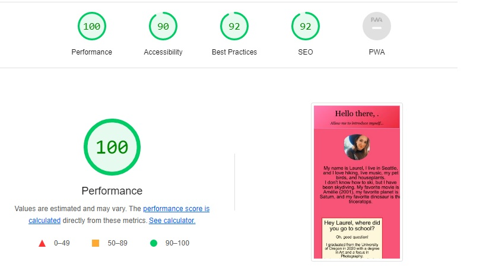

# Lab-02, -03, -04, -05b

## About-Me

I'm building a website all about me, my goals, and Britney Spears I guess, using the HTML, CSS, and JavaScript I'm learning in class.

### Author: Laurel Perkins

### Links and Resources

* I used  <https://www.w3schools.com/html/html_emojis.asp> to help me with using emojis in HTML.

* I used <https://medium.com/markdown-monster-blog/getting-images-into-markdown-documents-and-weblog-posts-with-markdown-monster-9ec6f353d8ec> to help me link the photo here in the ReadMe.

* Phil Chaplin and TA Mike helped me escape my nested loops in Lab-03.

* Kyle Freemantle was my Programming Partner for Lab-04.

* Deon Curry helped my figure out how to make my image circular using CSS.

* Phil Chaplin showed me how to get the gradient header on my page using CSS, as well as how get the usernme to show up on the page, and make my page accessible on mobile. Thanks a bunch, Phil!

* I used <https://stackoverflow.com/questions/9630414/falling-hearts-animation-for-browsers> to help add the falling hearts to my page, which was fun even though they still need some tweaking.

### Lighthouse Accessibility Report Score

### Reflections and Comments

* Lab-02: I'm having a lot of fun with this assignment. I think the repitition is really helping me learn code. JavaScript has been fun to learn and not that difficult so far. I'm really excited to learnwhat I can do with CSS, as I haven't used it much so far. Also, I am very, very unsure about using images in HTML...

* Lab-03: Today's lab was pretty rough. I was able to figure out the "How many times have I cried this week" loop without much issue, but when I nested the loops in "What is my favorite Britney era," I ran into some problems figuring out what code should go inside what loop. I had to get some help with this. Finding a way to count the number of correct answers was fairly easy for me, and once the wholwe thing was running as it should, it was so, so satisfying.

* Lab-04: Easy lab, loved working with a partner. It was different at first to have someone else "navigating" as I typed, but it was enjoyable and I felt I learned a lot from editing someone else's code.

* Final touches: I some how messed up all my JS whenI started adding CSS, but I was eventually able to fix it up. There are still things I want to change to this page, but don't understand how to yet, so I will probably revist this again later as I learn more :) I'm overall happy with the way it looks and the way it runs.
